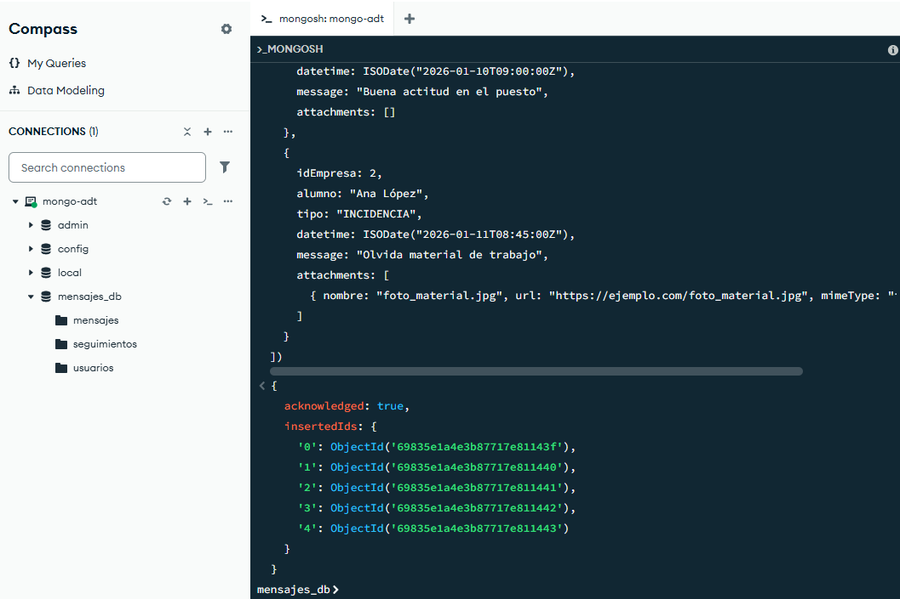
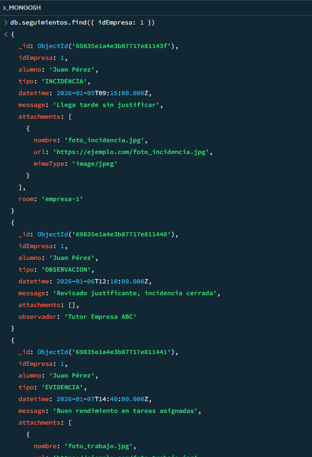
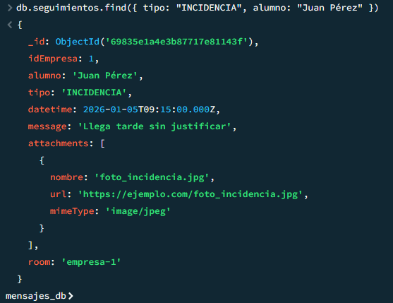
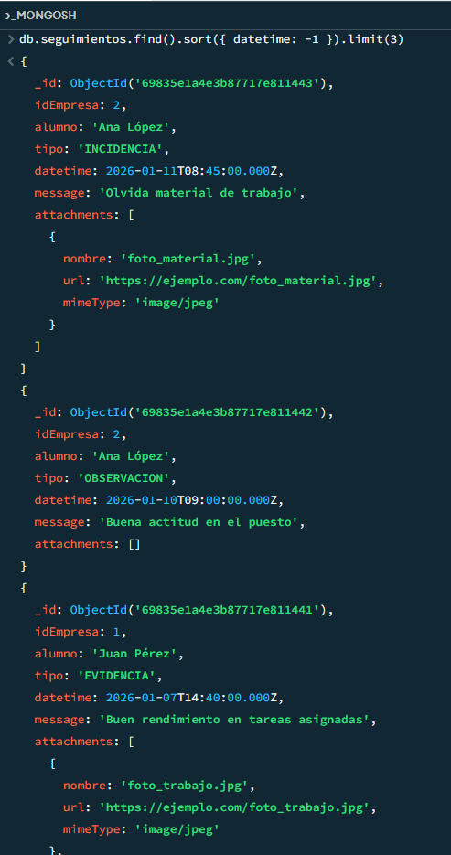
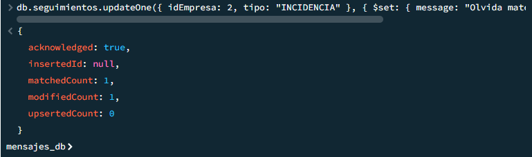
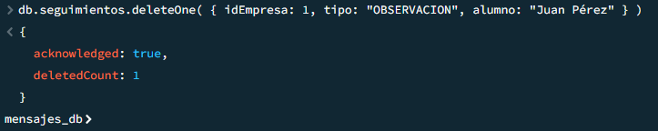
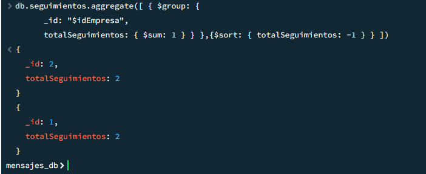
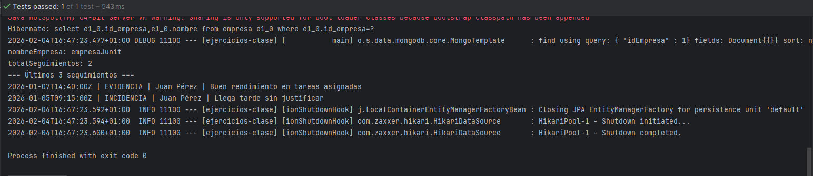

# Seguimientos en MongoDB (modelo híbrido)
## 1. Crear colección y documentos desde mongosh
```js
use mensajes_db

// Crear colección
db.seguimientos.insertMany([
  {
    idEmpresa: 1,
    alumno: "Juan Pérez",
    tipo: "INCIDENCIA",
    datetime: ISODate("2026-01-05T09:15:00Z"),
    message: "Llega tarde sin justificar",
    attachments: [
      { nombre: "foto_incidencia.jpg", url: "https://ejemplo.com/foto_incidencia.jpg", mimeType: "image/jpeg" }
    ],
    room: "empresa-1" // campo adicional opcional
  },
  {
    idEmpresa: 1,
    alumno: "Juan Pérez",
    tipo: "OBSERVACION",
    datetime: ISODate("2026-01-06T12:10:00Z"),
    message: "Revisado justificante, incidencia cerrada",
    attachments: [],
    observador: "Tutor Empresa ABC"
  },
  {
    idEmpresa: 1,
    alumno: "Juan Pérez",
    tipo: "EVIDENCIA",
    datetime: ISODate("2026-01-07T14:40:00Z"),
    message: "Buen rendimiento en tareas asignadas",
    attachments: [
      { nombre: "foto_trabajo.jpg", url: "https://ejemplo.com/foto_trabajo.jpg", mimeType: "image/jpeg" },
      { nombre: "video_proceso.mp4", url: "https://ejemplo.com/video_proceso.mp4", mimeType: "video/mp4" }
    ]
  },
  {
    idEmpresa: 2,
    alumno: "Ana López",
    tipo: "OBSERVACION",
    datetime: ISODate("2026-01-10T09:00:00Z"),
    message: "Buena actitud en el puesto",
    attachments: []
  },
  {
    idEmpresa: 2,
    alumno: "Ana López",
    tipo: "INCIDENCIA",
    datetime: ISODate("2026-01-11T08:45:00Z"),
    message: "Olvida material de trabajo",
    attachments: [
      { nombre: "foto_material.jpg", url: "https://ejemplo.com/foto_material.jpg", mimeType: "image/jpeg" }
    ]
  }
])
```


## 1.1. Consultas find() con filtros
```js
// 1) Filtrar por idEmpresa
db.seguimientos.find({ idEmpresa: 1 })

// 2) Filtrar por tipo e alumno
db.seguimientos.find({ tipo: "INCIDENCIA", alumno: "Juan Pérez" })
```



## 1.2. Ordenación por fecha y limit
```js
// 3 últimos seguimientos ordenados de más reciente a más antiguo
db.seguimientos.find()
  .sort({ datetime: -1 })
  .limit(3)
```


## 1.3. UpdateOne y DeleteOne
```js
// updateOne: cambiar el mensaje de una incidencia concreta
db.seguimientos.updateOne(
  { idEmpresa: 2, tipo: "INCIDENCIA" },
  { $set: { message: "Olvida material de trabajo (actualizado)" } }
)

// deleteOne: borrar un seguimiento concreto
db.seguimientos.deleteOne(
  { idEmpresa: 1, tipo: "OBSERVACION", alumno: "Juan Pérez" }
)
```



## 1.4. Agregación: ranking por idEmpresa
```js
db.seguimientos.aggregate([
  {
    $group: {
      _id: "$idEmpresa",
      totalSeguimientos: { $sum: 1 }
    }
  },
  {
    $sort: { totalSeguimientos: -1 }
  }
])
```


### 2. Spring Boot (MongoDB + MySQL)
## 2.1. Modelo Java: `Seguimiento` y `Attachment`
Creación de la clase seguimiento 
```java
package com.adt.ejercicios_clase.model;

import org.springframework.data.annotation.Id;
import org.springframework.data.mongodb.core.mapping.Document;

import java.time.Instant;
import java.util.List;

@Document(collection = "seguimientos")
public class Seguimiento {

    @Id
    private String id;

    private Integer idEmpresa;      
    private String alumno;
    private String tipo;           
    private Instant datetime;       
    private String message;

    private List<Attachment> attachments;

    // getters, setters, constructores
}
```
Clase attachment
```java
package com.adt.ejercicios_clase.model;

public class Attachment {
    private String nombre;
    private String url;
    private String mimeType; // image/jpg applicacion/pdf

    public Attachment(String nombre, String url, String mimeType) {
        this.nombre = nombre;
        this.url = url;
        this.mimeType = mimeType;
    }

    public Attachment() {

    }
}
    // getters, setters, constructores
```

## 2.2. Repositorio Mongo para Seguimiento
```java
package com.adt.ejercicios_clase.repository.mongo.dto;

import com.adt.ejercicios_clase.model.Seguimiento;
import org.springframework.data.mongodb.repository.MongoRepository;
import org.springframework.data.mongodb.repository.Query;
import java.util.List;

public interface SeguimientoRepository extends MongoRepository<Seguimiento, String> {
    
    List<Seguimiento> findByIdEmpresa(Integer idEmpresa);
    @Query(
            value = "{ 'attachments.mimeType': ?0 }",
            fields = "{ 'alumno': 1, 'tipo': 1, 'datetime': 1, 'message': 1, '_id': 0 }"
    )
    List<Seguimiento> findByAttachmentMimeTypeProjected(String mimeType);
}
```
## 2.3 Prueba / ejecución
### Acceso a MySQL: entidad Empresa y repositorio
Creamos la clase empresa
```java
package com.adt.ejercicios_clase.model;

import jakarta.persistence.Entity;
import jakarta.persistence.Id;
import jakarta.persistence.Table;

@Entity
@Table(name = "empresa")
public class Empresa {

    @Id
    private Integer idEmpresa;

    private String nombre;

    // getters, setters
}
```
Creamos la clase EmpresaRepository
```java
package com.adt.ejercicios_clase.repository.mongo;

import com.adt.ejercicios_clase.model.Empresa;
import org.springframework.data.jpa.repository.JpaRepository;

public interface EmpresaRepository extends JpaRepository<Empresa, Integer> {
    
}
```

## 2.4 Test JUnit integrando MySQL + MongoDB
```java
package com.adt.ejercicios_clase.model;

import com.adt.ejercicios_clase.repository.mongo.EmpresaRepository;
import com.adt.ejercicios_clase.repository.mongo.SeguimientoRepository;
import org.junit.jupiter.api.Test;
import org.springframework.beans.factory.annotation.Autowired;
import org.springframework.boot.test.context.SpringBootTest;
import java.util.Comparator;
import java.util.List;

@SpringBootTest
class SeguimientoHibridoTest {

    @Autowired
    private EmpresaRepository empresaRepository;
    @Autowired
    private SeguimientoRepository seguimientoRepository;

    @Test
    void resumenSeguimientosPorEmpresa() {
        Integer idEmpresa = 1;

        Empresa empresa = empresaRepository.findById(idEmpresa)
                .orElseThrow(() -> new RuntimeException("Empresa no encontrada: " + idEmpresa));


        List<Seguimiento> seguimientos = seguimientoRepository.findByIdEmpresa(idEmpresa);


        System.out.println("nombreEmpresa: " + empresa.getNombre());
        System.out.println("totalSeguimientos: " + seguimientos.size());

        List<Seguimiento> ultimosTres = seguimientos.stream()
                .sorted(Comparator.comparing(Seguimiento::getDatetime).reversed())
                .limit(3)
                .toList();

        System.out.println("=== Últimos 3 seguimientos ===");
        ultimosTres.forEach(s -> {
            System.out.println(
                    s.getDatetime() + " | " +
                            s.getTipo() + " | " +
                            s.getAlumno() + " | " +
                            s.getMessage()
            );
        });
    }
}
```



