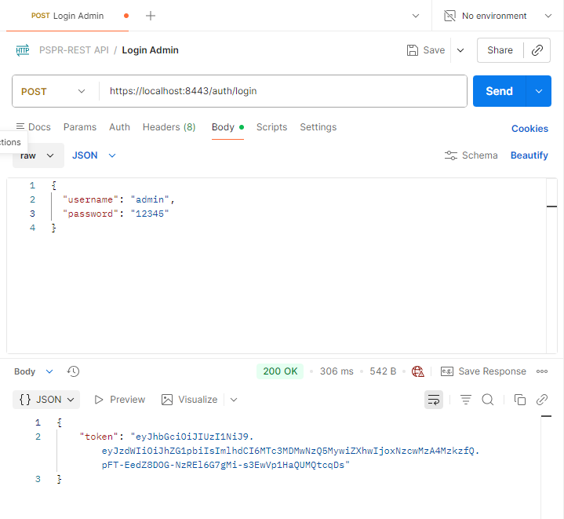
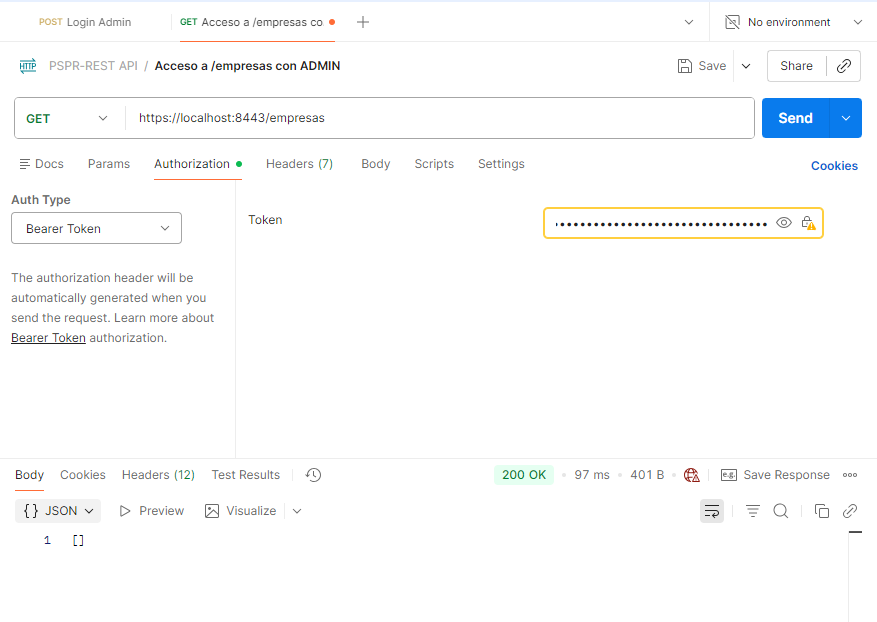
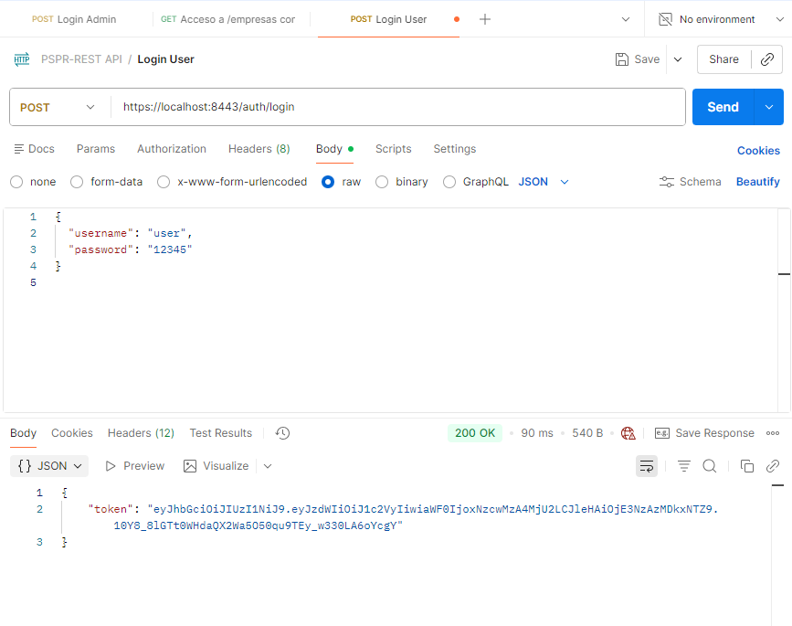
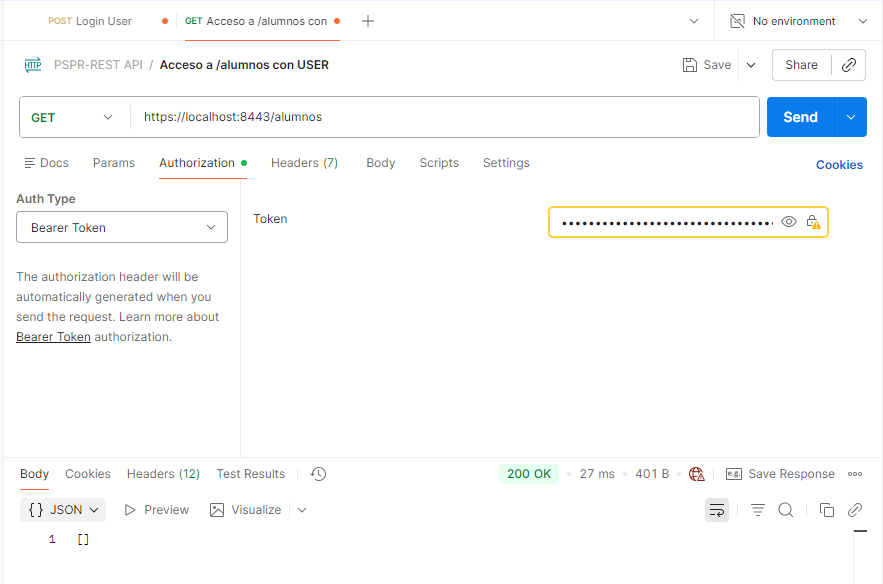
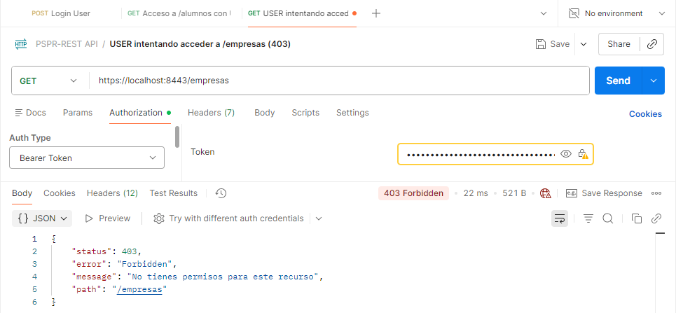
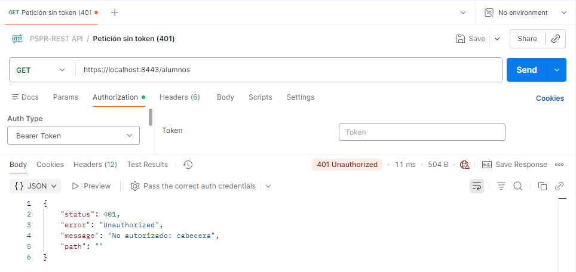
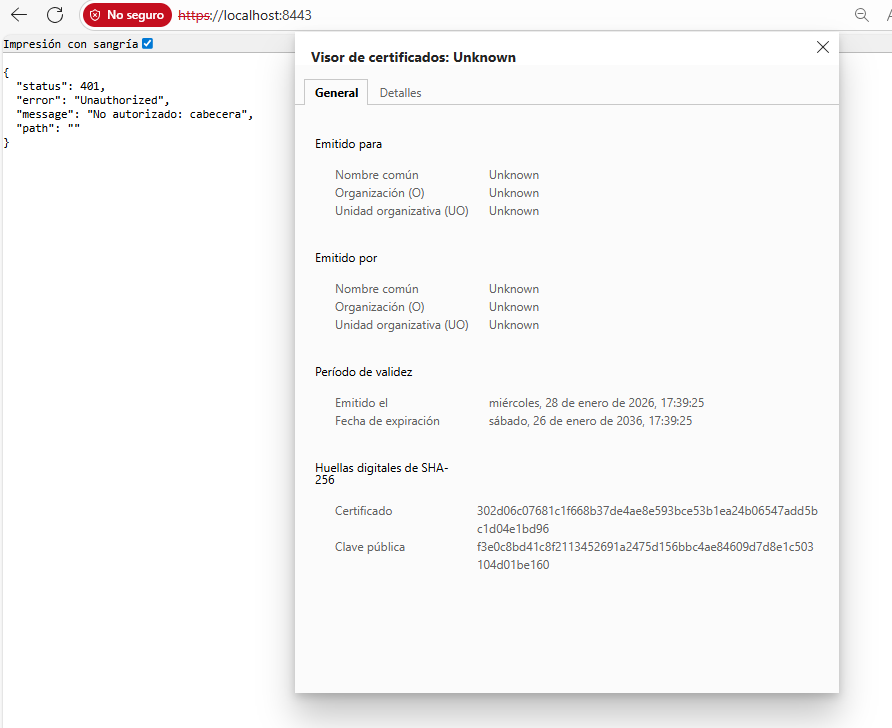

## Pruebas con Postman (JWT + roles)

### 1. Login como ADMIN

- Método: POST
- URL: `https://localhost:8443/auth/login`
- Body (JSON):
```json
{
  "username": "admin",
  "password": "1234"
}
```


### 1.1 Acceso a /empresas con ADMIN
Usamos el token de ADMIN
- URL: `https://localhost:8443/empresas`



### 2. Login como USER
- Método: POST
- URL: `https://localhost:8443/auth/login`
- Body (JSON):
```json
{
  "username": "user",
  "password": "12345"
}
```


### 2.1 Acceso a /alumnos con USER
Usamos el toker de USER
- URL: `https://localhost:8443/alumnos`


### 2.1 USER intentando acceder a /empresas (403)
Usamos el token de USER
- URL: `https://localhost:8443/empresas`


### 3. Petición sin token (401)
- URL: `https://localhost:8443/alumnos`


### 4. HTTPS habilitado
- URL: `https://localhost:8443/`
- 